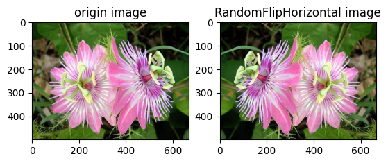
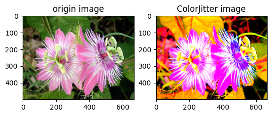

# 数据预处理  
在模型训练过程中有时会遇到过拟合的问题，其中一个解决方法就是对训练数据做数据增强处理。通过对数据进行特定的处理，如图像的裁剪、翻转、调整亮度等处理，以增加样本的多样性，从而增强模型的泛化能力。  

本节以图像数据为例，介绍数据预处理的方法。

## 一、tensorlayerx.vision.transforms 介绍
TensorLayerX框架在 [`tensorlayerx.vision.transforms`](https://github.com/tensorlayer/TensorLayerX/blob/main/tensorlayerx/vision/transforms.py) 下内置了数十种图像数据处理方法，可以通过以下代码查看：
```
import tensorlayerx
print('图像数据处理方法：', tensorlayerx.vision.transforms.__all__)
```
```
图像数据处理方法： ['Crop', 'CentralCrop', 'HsvToRgb', 'AdjustBrightness', 'AdjustContrast', 'AdjustHue', 'AdjustSaturation', 'FlipHorizontal', 'FlipVertical', 'RgbToGray', 'PadToBoundingbox', 'Pad', 'Normalize', 'StandardizePerImage', 'RandomBrightness', 'RandomContrast', 'RandomHue', 'RandomSaturation', 'RandomCrop', 'Resize', 'RgbToHsv', 'Transpose', 'Rotation', 'RandomRotation', 'RandomShift', 'RandomShear', 'RandomZoom', 'RandomFlipVertical', 'RandomFlipHorizontal', 'HWC2CHW', 'CHW2HWC', 'ToTensor', 'Compose', 'RandomResizedCrop', 'RandomAffine', 'ColorJitter', 'Rotation']
```
包括图像随机裁剪、图像旋转变换、改变图像亮度、改变图像对比度等常见操作，各个操作方法的简介可参考 API 文档。  

对于TensorlayerX框架内置的数据预处理方法，可以单个调用，也可以将多个数据预处理方法进行组合使用，具体使用方式如下：

* 单个使用  

```
from tensorlayerx.vision.transforms import Resize

transform = Resize(size = (100,100), interpolation='bilinear')
```

* 多个组合使用

这种使用模式下，需要先定义好每个数据处理方法，然后用`Compose` 进行组合。
```
from tensorlayerx.vision.transforms import (
    Compose, Resize, RandomFlipHorizontal, RandomContrast, RandomBrightness, StandardizePerImage, RandomCrop
)

transforms = Compose(
    [
        RandomCrop(size=[24, 24]),
        RandomFlipHorizontal(),
        RandomBrightness(brightness_factor=(0.5, 1.5)),
        RandomContrast(contrast_factor=(0.5, 1.5)),
        StandardizePerImage()
    ]
)
```
## 二、在数据集中应用数据预处理操作
定义好数据处理方法后，可以直接在数据集 `Dataset` 中应用，下面介绍数据预处理在自定义的数据集中的应用方式。  

对于自定义的数据集，可以在数据集中将定义好的数据处理方法传入 `__init__` 函数，将其定义为自定义数据集类的一个属性，然后在 `__getitem__` 中将其应用到图像上，如下述代码所示：

```
# TensorLayerX自动下载并加载 MNIST 数据集
print('download training data and load training data')

X_train, y_train, X_val, y_val, X_test, y_test = tlx.files.load_mnist_dataset(shape=(-1, 28, 28, 1))
X_train = X_train * 255

print('load finished')


class MNISTDataset(Dataset):
    """
    步骤一：继承 tensorlayerx.dataflow.Dataset 类
    """

    def __init__(self, data=X_train, label=y_train, transform=transform):
        """
        步骤二：实现 __init__ 函数，初始化数据集，将样本和标签映射到列表中
        """

        self.data = data
        self.label = label
        self.transform = transform

    def __getitem__(self, index):
        """
        步骤三：实现 __getitem__ 函数，定义指定 index 时如何获取数据，并返回单条数据（样本数据、对应的标签）
        """

        data = self.data[index].astype('float32')
        data = self.transform(data)
        label = self.label[index].astype('int64')

        return data, label

    def __len__(self):
        """
        步骤四：实现 __len__ 函数，返回数据集的样本总数
        """

        return len(self.data)

transform = Compose([Normalize(mean=[127.5], std=[127.5], data_format='HWC')])
train_dataset = MNISTDataset(data=X_train, label=y_train, transform=transform)

```

## 三、数据预处理的几种方法介绍
通过可视化的方法，可方便地对比TensorLayerX内置数据处理方法的效果，下面介绍其中几个方法的对比示例。

首先下载示例图片
```
# 下载示例图片
wget https://paddle-imagenet-models-name.bj.bcebos.com/data/demo_images/flower_demo.png
```

### `CentralCrop`
对输入图像进行裁剪，保持图片中心点不变。

```
import cv2
import numpy as np
from PIL import Image
from matplotlib import pyplot as plt
from tensorlayerx.vision.transforms import CentralCrop

transform = CentralCrop(size = (224, 224))

image = cv2.imread('flower_demo.png')

image_after_transform = transform(image)
plt.subplot(1,2,1)
plt.title('origin image')
plt.imshow(image[:,:,::-1])
plt.subplot(1,2,2)
plt.title('CenterCrop image')
plt.imshow(image_after_transform[:,:,::-1])
```


### `RandomFlipHorizontal`
基于概率来执行图片的水平翻转。

```
import numpy as np
from PIL import Image
from matplotlib import pyplot as plt
from tensorlayerx.vision.transforms import RandomFlipHorizontal

transform = RandomFlipHorizontal(0.5)

image = cv2.imread('flower_demo.png')

image_after_transform = transform(image)
plt.subplot(1,2,1)
plt.title('origin image')
plt.imshow(image[:,:,::-1])
plt.subplot(1,2,2)
plt.title('RandomFlipHorizontal image')
plt.imshow(image_after_transform[:,:,::-1])
```



### `ColorJitter`
随机调整图像的亮度、对比度、饱和度和色调。
```
import numpy as np
from PIL import Image
from matplotlib import pyplot as plt
from tensorlayerx.vision.transforms import ColorJitter

transform = ColorJitter(brightness=(1,5), contrast=(1,5), saturation=(1,5), hue=(-0.2,0.2))

image = cv2.imread('flower_demo.png')

image_after_transform = transform(image)
plt.subplot(1,2,1)
plt.title('origin image')
plt.imshow(image[:,:,::-1])
plt.subplot(1,2,2)
plt.title('ColorJitter image')
plt.imshow(image_after_transform[:,:,::-1])
```


更多数据处理方法介绍可以参考 [tensorlayerx.vision.transforms](https://tensorlayerx.readthedocs.io/en/latest/modules/vision.html#vision-transforms) API 文档。